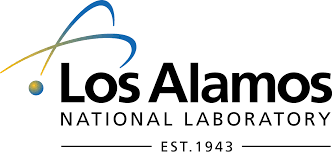
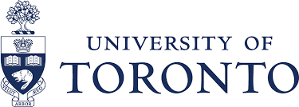

# The Turbulence Collaboration

The Turbulence Collaboration started as an exploratory project between graduate school friends, Gavin Portwood and Peetak Mitra, that turned into a potentially important research project. Turbulence is a key driver in climate physics, internal combustion engines, geophysical flows etc.,and getting turbulence right is really key to developing truly predictive modeling frameworks. It is for this reason, Dr. Richard Feynman called turbulence as the "most important unsolved problem in classical physics".

The primary goal behind this collaborative effort is to develop and apply advanced machine learning algorithms to improve our understanding of the physics of turbulence. These learned algorithms can be then used to improve existing model fidelity.

This is a multi-institution effort between academia, national laboratories and the industry and some of the problems we are currently looking at include improving popular two-equation turbulence models (under simplified assumptions), geophysical turbulence as well as building a pathway to create better climate sub-models.

# Participating Institutions

         

## Members of the project

Gavin Portwood, co-founder, XCP-4 Los Alamos National Laboratory, Los Alamos, NM
Peetak Mitra, co-founder, CCS-2 (GRA), Los Alamos National Laboratory, Los Alamos, NM
Mateus Dias Ribiero

# Publications

# Data-sets

# How to connect
img2 {
  border-radius: 50%;
}

<img2 src="./assets/img/DKI.jpeg" alt="UMass" width="200" height="80">
